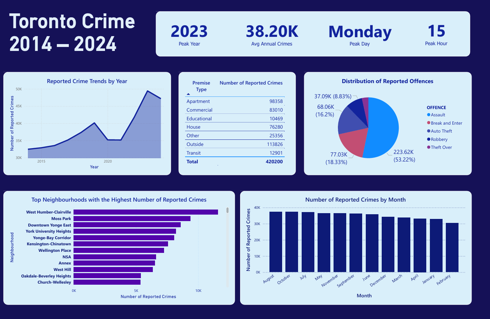

# 📊 Toronto Crime Analysis

This project explores reported crime in Toronto between 2014 and 2024 using SQL for data cleaning and Power BI for visual analysis.

### Objective
The objective of this project is to analyze crime data in Toronto from 2014 to 2024 in order to identify high-crime neighbourhoods, observe trends over time, determine the most common types of offences, understand temporal patterns such as peak days, months, and hours, and examine the premises where crimes most frequently occur.

### Data Source
Dataset: [Toronto Crime Data (Kaggle)](https://www.kaggle.com/datasets/mohammadbadi/crimes-in-toronto)

### Dashboard (Power BI)

### Key Findings
- **West Humber–Clairville** is the neighbourhood with the highest number of reported crimes
- **2023** was the most active year for reported crimes across Toronto
- **Assault** is the most commonly reported offence
- On average, there are **~38,200 crimes reported per year**
- **August** is the month with the highest activity
- Reported crimes are most frequent on **Mondays**
- The overall peak hour is **15:00 (3 PM)**
- **Apartments** are the most common premises for reported crimes
