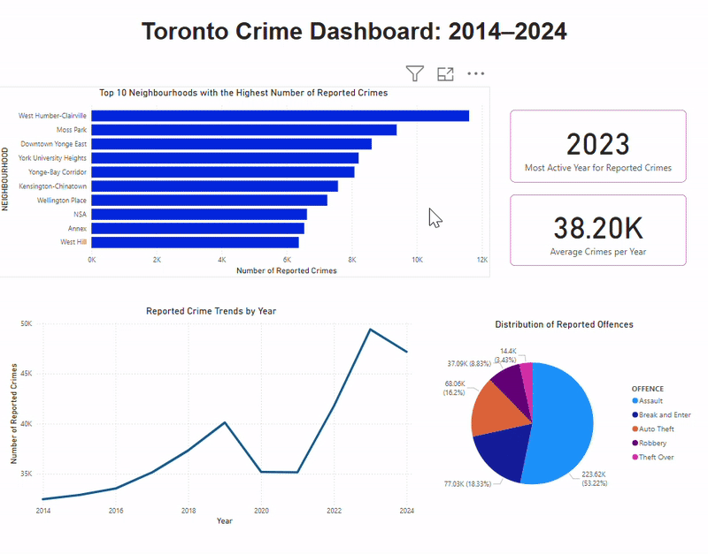

# 📊 Toronto Crime Analysis

This project explores reported crime in Toronto between 2014 and 2024 using SQL for data cleaning and Power BI for visual analysis.

### Objective
To analyze crime data from 2014 to 2024 in Toronto in order to identify high- and low-crime neighbourhoods, trends over time, and the most common types of offences.

### Data Source
Dataset: [Toronto Crime Data (Kaggle)](https://www.kaggle.com/datasets/mohammadbadi/crimes-in-toronto)

### Dashboard (Power BI)

### Key Findings
- **West Humber–Clairville** is the neighbourhood with the highest number of reported crimes
- **2023** was the most active year for reported crimes across Toronto
- **Assault** is the most commonly reported offence
- On average, there are **~38,200 crimes reported per year**
